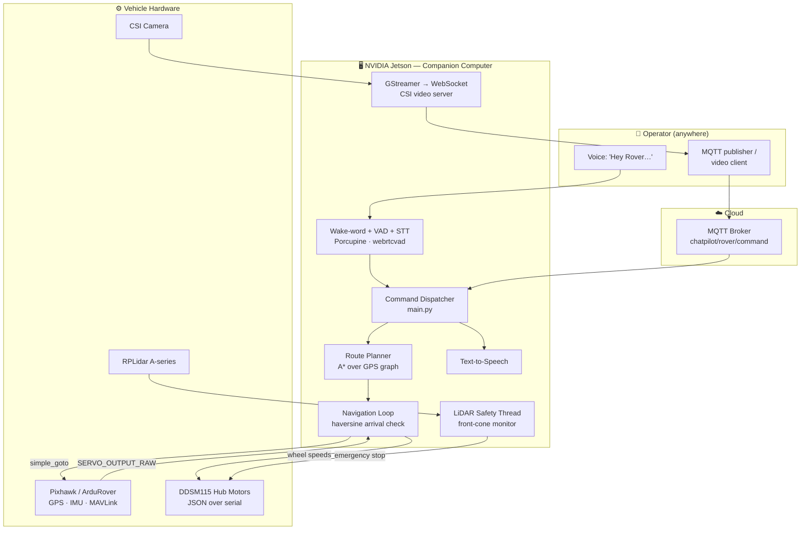

# ChatPilot — Voice-Commanded Autonomous Delivery Rover

**A GPS-navigating, LiDAR-aware ground robot that you talk to.** Say *"Hey Rover, navigate to node 6"* — and a 4-wheel skid-steer rover plans the shortest route across a surveyed campus map, drives itself there, stops for anything that walks in front of it, and streams live video back to an operator anywhere in the world.

Built on an NVIDIA Jetson + Pixhawk stack in Python, with an MQTT cloud control plane.


---

## The Problem

Last-mile movement of small payloads — lab samples between departments, medicines across a hospital campus, documents between office blocks — is still done by a human walking. It is slow, it doesn't scale, and during a pandemic or a hazardous-material transfer it is actively unsafe.

Existing answers don't fit this gap:

- **Commercial delivery robots** cost tens of thousands of dollars and are locked to vendor cloud platforms.
- **Warehouse AGVs** rely on floor markers, rails, or pre-installed beacons — they cannot cross an open campus.
- **Hobby rovers** offer teleoperation only: a human still has to drive, and still has to be within range.
- **All of them** require an operator trained on a control app. Nobody at a reception desk wants to learn a waypoint editor.

**ChatPilot's thesis:** the interface to a delivery robot should be a *sentence*, and the hardware under it should be commodity drone parts. A ₹-scale build of off-the-shelf components — a flight controller, a hub-motor chassis, a 360° LiDAR, and a Jetson — is enough to deliver autonomously across a real outdoor campus, if the software is designed properly.

---

## What It Does

| Capability                                         | Detail                                                                                                                                  |
| -------------------------------------------------- | --------------------------------------------------------------------------------------------------------------------------------------- |
| 🗣️**Voice command**                        | Offline wake-word detection ("Hey Rover") → voice-activity-gated recording → speech-to-text → rover action. No button press, no app. |
| 🗺️**Autonomous point-to-point navigation** | `NAVIGATE:0,6` plans the shortest route over a surveyed GPS graph and drives every waypoint unattended.                               |
| 🛰️**GPS waypoint following**               | Haversine-based arrival detection; the rover self-corrects heading continuously until each node is within tolerance.                    |
| 🛡️**360° obstacle safety layer**          | A LiDAR thread monitors the forward cone independently of the control loop and can cut motor power mid-command.                         |
| ☁️**Remote command & telemetry**           | MQTT over a public broker — the rover is drivable and observable from any network, not just line-of-sight RF.                          |
| 📹**Live video**                             | Hardware-encoded JPEG frames streamed over WebSocket from the Jetson CSI camera to any operator client.                                 |
| 🔊**Spoken feedback**                        | On-board TTS confirms every command and announces route distance, so a non-technical user knows the robot heard them.                   |
| 🎮**Manual override + map survey mode**      | WASD teleop that doubles as the tool used to record the campus graph in the first place.                                                |

---

## System Architecture



---

## How It Works

### 1. Surveying the map — turning a campus into a graph

Autonomy needs a map, and no map of a college campus exists at rover resolution. So the rover builds its own:

1. An operator drives the rover manually with `key.py` (WASD skid-steer teleop).
2. At every junction where a turn is possible, they press `r` — the current Pixhawk GPS fix is appended to `logged_coordinates.txt` as a **node**.
3. `getGraph.py` converts those nodes plus their connectivity into a **weighted adjacency list**, where every edge weight is the true great-circle distance between two nodes computed with the **haversine formula**.

The result is a metric graph of the campus — `0: 1 (13.71m)`, `1: 0 (13.71m), 2 (14.54m)` — built entirely from data the robot collected about the environment it will operate in.

### 2. Route planning — shortest path over real distances

`AStarSearch.py` runs a heap-backed **A\*** search over that graph. Because edge weights are real-world metres, the returned cost *is* the driving distance, which the rover speaks aloud before departing: *"Navigating from 0 to 6. Distance 57.67 metres."*

The search normalises the graph to bidirectional edges on load (a corridor is traversable both ways) and returns each waypoint already resolved to its `(lat, lon, alt)` coordinates, so the navigation layer needs no second lookup.

> *Implementation note:* the heuristic is currently a zero-function, which makes the search provably optimal but equivalent to uniform-cost/Dijkstra. Because coordinates are attached to every node, dropping in a haversine straight-line heuristic — admissible for metric edge weights — is a one-function change to gain directed expansion.

### 3. Navigation — letting the flight controller do the control theory

This is the core design decision of the project.

The rover uses **DDSM115 hub motors** that accept raw JSON wheel-speed commands over serial. They have no notion of heading, GPS, or a PID loop. Writing a full heading controller on the Jetson would mean re-implementing — badly — what ArduPilot has spent a decade perfecting.

Instead, ChatPilot **borrows ArduPilot's controller**:

1. The Jetson issues `simple_goto(lat, lon)` to the Pixhawk over MAVLink.
2. ArduRover runs its own tuned navigation and steering loop and emits the result as **RC servo PWM outputs**.
3. The Jetson subscribes to the `SERVO_OUTPUT_RAW` MAVLink stream, reads `servo1` (left) and `servo3` (right), and maps PWM → wheel speed:

   ```python
   speed = int((servo_value - 1500) / 500 * 100)   # 1000–2000 µs → −100…+100
   ```
4. Those speeds are serialised as `{"T":10010,"id":1,"cmd":<speed>,"act":3}` and written to the motor driver.

The Pixhawk believes it is driving a conventional rover; the Jetson silently transparently translates its intent onto hardware it was never designed for. **Professional-grade navigation on non-standard actuators, with no control code of our own.**

Arrival at each waypoint is judged by haversine distance against a tolerance radius rather than by the flight controller's own accept-radius, so waypoint spacing stays under application control.

### 4. Obstacle safety — a supervisor that outranks the planner

An RPLidar A-series spins on a **dedicated daemon thread**, consuming `iter_scans()` continuously and independently of the navigation loop. Any return inside the forward cone (**±15°**) closer than the safety threshold (**1 m**) marks the path blocked.

Safety is enforced as a *veto*, not as a request: the obstacle flag is guarded by a lock and checked inside `motor_control()` itself, so a stale or in-flight movement command physically cannot reach the wheels while the path is blocked. Motion resumes automatically the moment the cone clears — no operator round-trip.

The R&D branch extends this to full **reactive avoidance**: sector minima are computed with NumPy across front/left/right arcs, and the rover picks the clear side, executes a timed bypass manoeuvre, and rejoins its original heading.

### 5. Voice interface — three stages, fully hands-free

1. **Wake word** — Picovoice Porcupine runs a custom `Hey-rover` model continuously on-device, at low CPU cost, with no network and no audio ever leaving the robot until the user actually speaks to it.
2. **Endpointing** — on wake, `webrtcvad` performs frame-level voice-activity detection at 30 ms granularity and records until it observes a full second of silence, so utterances are captured at their natural length instead of a fixed timeout. Automatic gain control and peak normalisation are applied before recognition, which materially improves accuracy on a noisy I²S MEMS mic.
3. **Recognition → action** — the normalised WAV is transcribed and mapped to a rover command, which enters the same dispatcher the remote MQTT path uses. One command pipeline, two front-ends.

Every accepted command is acknowledged through **pyttsx3 TTS** — motion, direction, route distance, and arrival are all spoken.

### 6. Command & control plane — MQTT

The rover subscribes to `chatpilot/rover/command` on a cloud broker; the scheduler build additionally publishes execution state to `chatpilot/rover/status`. Because control rides on MQTT rather than a radio link, **operating range is internet range**: the rover can be commanded from a different city over a lightweight, low-bandwidth pub/sub protocol designed for exactly this class of device.

Supported commands:

```
FORWARD | BACKWARD | LEFT | RIGHT | STOP | NAVIGATE:<start_node>,<end_node>
```

### 7. Live video — zero-copy hardware pipeline

`ws_cam.py` runs a GStreamer pipeline that keeps frames on the GPU end-to-end: `nvarguscamerasrc → NVMM buffer → nvjpegenc` uses the Jetson's **dedicated hardware JPEG encoder**, never touching the CPU for compression. Encoded frames are handed from the GStreamer thread to an asyncio WebSocket server via `run_coroutine_threadsafe` and fanned out to all connected clients concurrently, with failed peers reaped automatically. 640×480 @ 30 fps, multi-client, decoded by an OpenCV client in ~40 lines.

### 8. Priority-based task scheduling *(R&D branch)*

A more advanced controller models every instruction as a **preemptible task** on a priority heap:

| Priority      | Task class                                              |
| ------------- | ------------------------------------------------------- |
| `EMERGENCY` | Emergency stop — flushes the queue and halts instantly |
| `HIGH`      | Obstacle-avoidance manoeuvres                           |
| `MEDIUM`    | Autonomous route navigation                             |
| `LOW`       | Manual directional movement                             |

Each task executes on its own interruptible thread with a `threading.Event` kill switch. A higher-priority arrival preempts the running task, pushes it onto an interrupted stack, and **resumes it automatically** once the interrupt clears — so an obstacle detected halfway through a delivery route suspends navigation, avoids, and then continues the route rather than aborting it.

---

## Tech Stack

**Languages & Runtime** · Python 3, asyncio, threading
**Robotics & Control** · DroneKit, MAVLink, ArduPilot/ArduRover, PySerial
**Perception** · RPLidar SDK, NumPy, OpenCV (ORB visual-odometry experiments)
**Voice** · Picovoice Porcupine, webrtcvad, SpeechRecognition, sounddevice/SoundFile, pyttsx3
**Networking** · Eclipse Paho MQTT, WebSockets, HTTP multipart
**Media** · GStreamer, NVIDIA nvarguscamerasrc / nvjpegenc, RTSP
**Algorithms** · A\* / Dijkstra, haversine geodesics, priority queues, VAD, sector-based obstacle logic

## Hardware

| Component                                 | Role                                                      |
| ----------------------------------------- | --------------------------------------------------------- |
| NVIDIA Jetson                             | Companion computer — autonomy, voice, vision, networking |
| Pixhawk flight controller (ArduRover)     | GPS, IMU, navigation & steering control                   |
| Waveshare DDSM115 direct-drive hub motors | Skid-steer drivetrain, JSON-over-serial                   |
| RPLidar A-series                          | 360° obstacle detection                                  |
| CSI camera module                         | Live video                                                |
| I²S MEMS microphone + speaker            | Voice input and spoken feedback                           |

---

## Repository Structure

```
src/                    Production system
  main.py               Command dispatcher, navigation loop, LiDAR safety thread
  main2.py              Hardened variant — lock-guarded obstacle veto in the motor layer
  AStarSearch.py        A* shortest-path over the weighted GPS graph
  getGraph.py           Map builder — GPS nodes → haversine-weighted adjacency list
  key.py                Teleop + GPS survey tool used to record the campus map
  ws_cam.py             Hardware-encoded CSI video → WebSocket server
  *.txt                 Surveyed campus map (nodes, coordinates, edge weights)

test/                   R&D, prototypes and hardware bring-up
  Wakeword/             Porcupine + VAD + STT voice pipeline
  ShortestPath-2/       Priority-based preemptible task scheduler
  Lidar-integration/    Reactive obstacle-avoidance with sector analysis
  Microphone/           I²S mic characterisation and STT experiments
  MQTT/                 Broker integration and video-over-MQTT trials
  Rover-Control/        Hardware bring-up: motors, relays, encoders, RC override
  ChatPilot.pdf         Project report   ·   Demo-1.mp4  Field demonstration
```

## Running It

```bash
pip install -r src/requirements.txt
```

DroneKit requires **Python ≤ 3.9**. Run all commands from inside `src/` — map files are resolved relative to the working directory.

**1 · Survey the map** (drive the route once, press `r` at each junction):

```bash
python3 key.py
```

**2 · Build the weighted graph:**

```bash
python3 getGraph.py
```

**3 · Launch the rover:**

```bash
python3 main.py
```

**4 · Send it somewhere** — from any machine with network access:

```bash
python3 -c "import paho.mqtt.publish as p; p.single('chatpilot/rover/command', 'NAVIGATE:0,6', hostname='<broker-ip>')"
```

**5 · Watch the feed:**

```bash
python3 ws_cam.py        # on the Jetson
python3 ../test/cam_client.py   # on the operator machine
```

---

## Engineering Highlights

- **Bridged two incompatible control domains** — MAVLink servo output and JSON hub-motor commands — by treating ArduPilot's steering solution as a signal to be transcoded rather than replaced.
- **Concurrency under real-time safety constraints**: LiDAR ingest, MAVLink telemetry callbacks, MQTT dispatch, TTS, and the navigation loop all run concurrently, with the obstacle veto enforced at the lowest layer so no code path can bypass it.
- **Built the dataset the algorithm needed**, rather than assuming one existed — the teleop tool, the survey format, the graph builder and the planner were designed as one pipeline.
- **Hardware-accelerated media path** — video is encoded on the Jetson's dedicated JPEG hardware and never round-trips through the CPU, keeping the compute budget free for autonomy.
- **Offline-first voice** — wake-word detection runs entirely on-device; audio only leaves the robot after the user has deliberately addressed it.
- **Designed for degradation** — optional imports, port-open failure handling, GPS-fix waiting, and graceful shutdown paths that disarm the vehicle and stop the motors on any exit.

## Roadmap

- [ ] Merge the wake-word voice pipeline into the production dispatcher (currently a validated standalone module)
- [ ] Haversine heuristic for directed A\* expansion
- [ ] Promote the preemptible priority scheduler into `main.py`
- [ ] TLS + authentication on the MQTT control plane
- [ ] Vision-based lane/path following (ORB odometry groundwork in `test/`)
- [ ] SLAM-based indoor operation where GPS is unavailable

---

## Documentation

📄 **[Project Report](test/ChatPilot.pdf)** · 🎥 **[Field Demo](test/Demo-1.mp4)**
